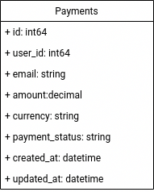

## Payment Service Emulator

**Payment Service Emulator** is the service that allows saving and changing status of payments. All data is saved in the database. Service accepts requests via REST API.

### Data

Database stores one entity:



_Status_ of the payment can take one of the following states: _new_, _success_, _failure_, _error_. _Currency_ can be _usd_, _rub_ or _eur_.

Payment Service uses PostgreSQL database.

### Payment cycle

1. User creates a new payment, it is created in the status of a _new_ or _error_ one. There is a chance of creating payment with _error_ status, 10% by default.
2. Payment system notifies service, using payment update request, of whether the payment has passed on its side, after which payment status changes to _success_ or _failure_.

Statuses _success_ and _failure_ are final — these statuses are impossible to change.

### REST API

You can perform following requests:

1. **POST** `/payment` — creates new payment (input accepts the user id, email, amount, and currency);
2. **PUT** `/payment/{id}` — updates payment status, use basic authorization to send this request;
3. **GET** `/payment/{id}` — returns payment status;
4. **GET** `/user/{id}/payment?limit=5&cursor=0` — returns all payments by user id;
5. **GET** `/user/payment?email=userEmail&limit=5&cursor=0` — returns payments by user email;
6. **DELETE** `/payment/{id}` — deletes payment. The API should return the error if cancellation is impossible.

There is OpenAPI documentation available, go to `127.0.0.1:8081` when the service is running

### How to run the service

Go to app directory and change `app.env` file to configure service. Also you can change `db.env` file to configure PostgreSQL.

To launch service run:

```bash
docker compose up -d --build
```

To access API go to `127.0.0.1:8080/api/v1/`. To access OpenAPI documentation go to `127.0.0.1:8081`.
